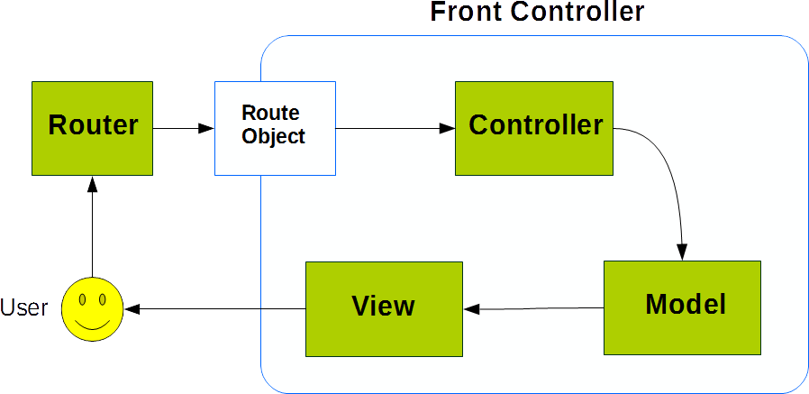

# Front Controller
Front Controller class is the shell for Linna Mvc pattern and provide a link with Linna Router class. Linna Mvc components runs inside Front Controller

## Work Flow


## How it works?
Class for run need a [Route](route.md), a [Model](model.md), a [View](view.md) and a [Controller](controller) instance. After it combine components and return the result of View
```php
//get route
$route = $router->getRoute();
  
//model
$model = new UserModel();

//view
$view = new UserView();

//controller
$controller = new UserController();

//start front controller
$frontController = new FrontController($route, $model, $view, $controller);

//run
$frontController->run();

//get front controller response
$frontController->response();
```

## Class Structure

Properties
- *no public properties*

Methods
- __construct()
- run()
- responce()

## Methods

### __construct()
Class constructor

#### Parameters
*RouteInterface* **$route**<br/>
*Model* **$model**<br/>
*View* **$view**<br/>
*Controller* **$controller**<br/>

#### Usage
```php
//start front controller
$frontController = new FrontController($route, $model, $view, $controller);
```

### run()
Starts the Mvc components interaction

#### Usage
```php
$frontController->run();
```

### responce()
Show the result of Mvc components interaction

#### Usage
```php
$frontController->response();
```