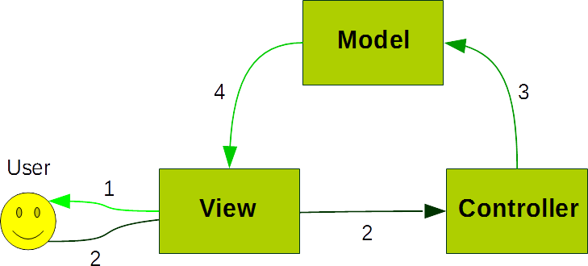

# How pattern is implemented?

In Linna Framework every Mvc component is implemented as isolated. Interaction between components happens through
[Dependency Injection](https://en.wikipedia.org/wiki/Dependency_injection) or 
through [Observer Pattern](https://en.wikipedia.org/wiki/Observer_pattern).

## Why

Because every piece of Mvc pattern should do only one thing. Model manipulate the data, View render it and Controller filter the user input.

## Component interaction

Model is passed to View and Controller by class constructor (constructor injection). 
Model and View works as Observer Pattern. 
Controllers and Views are at the same level, a Controller doesn't call a View and does not pass to it, data for render. 
Controller works only when is needed filter user input and manipulate data through Model 
View ask Model for obtain data for rendering.

This implementation require a declaration for all routes, which is the Model, Controller and View. 

## Work Flow

1. User see View output
2. User through View interacts with Controller that filter the passed data
3. Controller call Model for an action with User passed data (update, delete, create, etc.)
4. Model notify to View changes for output

When we must show only default data is no needed Controller job.
